I was doing some leetcode problems when I stumbled upon the [rotate array](https://leetcode.com/problems/rotate-array/) problem. Rotate $k$ means changing the order of its elements by shifting them to the right (rotate). For example, given an array `[1,2,3,4,5,6,7]`, and $k=3$, rotating the array by $k$ gives `[5,6,7,1,2,3,4]`.

Seems simple enough, I started with the simplest method:

## Using Temporary Array

Easiest way is to simply create a temporary array of size $k$, move the last $k$ elements into the temporary array, move each of the first $n-k$ elements to its index $+k$ (starting from the end to beginning). Then moving the temporary array back to the first $k$ elements of the array. Simple C++ code is as follow:

```c++
class Solution {
public:
  void rotate(vector<int> &nums, int k) {
    vector<int> temp(k);
    // copy to temporary array
    copy(begin(nums) + n-k, end(nums), begin(temp));
    // rotate the n-k elements
    for (int i = n-k-1; i >= 0; i--){
      nums[i+k] = nums[i];
    }
    // copy back
    copy(begin(temp), end(temp), begin(nums));
  }
};
```

Seems fine, the algorithm uses $O(k)$ to copy, $O(n-k)$ to rotate, and $O(k)$ to copy back, in total $O(n+k) = O(n)$ time complexity, but also uses $\Theta(k)$ extra memory.

In the hint, it said that there is a $O(1)$ space complexity algorithm.

## Bubble Rotate

In order to use $O(1)$ auxillary space, we can take inspiration from bubble sort, and try to bubble each of the $k$ last elements to its position minus $n-k$.

```c++
class Solution {
public:
  void rotate(vector<int> &nums, int k) {
    for (int i = 0; i < k; i++){
      int j = n - k - 1 + i;
      while (j >= i){
        swap(nums[j], nums[j+1]);
        j--;
      }
    }
  }
};
```

This runs in $O(1)$ auxillary space, but it also requires $O(n-k)$ swaps for each $k$ element, this causes it to be $O(k(n-k))$ time, and when $k\approx n/2$, this runs in $O(n^2)$.

The inefficiency comes from the fact that we already know where each element should go to analytically, but we are still using $O(n-k)$ to swap.

## Reverse Array

This solution is quite clever, first we reverse the first $n-k$ elements, we then reverse the last $k$ elements, finally, we reverse all $n$ elements.

Why does this work? We can prove it using algebra, first we use a basic lemma about array reverse:

`Lemma 1.1` (Reverse) Let $A$ be an array, and $A^r$ means $A$ reversed, then $- ^r$ has the following property:

$$
  (AB)^r = B^r A^r
$$

Where $AB$ means array $A$ concatenated with $B$. $\blacksquare$

The above lemma can be proved with simple induction. We now split the $k$ into two cases:

- If $k < n/2$, we can call the first $k$ elements $B$, middle $n-2k$ elements $C$, right $k$ elements $D$.

```mermaid
gantt
    dateFormat  X
    axisFormat .

    section Whole Array
    A   : 0, 60
    section Left k
    B   : 0, 10
    section Middle n-2k
    C   : 10, 50
    section Right k
    D    : 50, 60
```



Then after right rotating $k$ elements, the result would be $DBC$. Performing the reversing operation, we get:

1. Reverse the first $n-k$ elements, we get

   $$
     (BC)^rD = C^r B^r D
   $$

2. Reverse the last $k$ elements:

   $$
     C^rB^r D^r
   $$

3. Reverse the whole array:

   $$
     (C^rB^r D^r)^r = DBC
   $$

   Which is exactly what we wanted.

- Otherwise, if $2k \geq n$, then

```mermaid
gantt
    dateFormat  X
    axisFormat .

    section Whole Array
    A   : 0, 60
    section Left k
    k    : 0, 40
    section Right k
    k    : 20, 60
```



We let $B$ be the left $n-k$ elements, $C$ be the middle intersection $2k-n$ elements, and $D$ be the right $n-k$ elements.

```mermaid
gantt
    dateFormat  X
    axisFormat .

    section Whole Array
    A   : 0, 60
    section Left n-k
    B    : 0, 20
    section Middle 2k-n
    C    : 20, 40
    section Right n-k
    D    : 40, 60
```



The resulting array should be $CDB$, we go through the algorithm:

1. Reverse the first $n-k$ elements, we get

   $$
     B^rCD
   $$

2. Reverse the last $k$ elements:

   $$
     B^r D^r C^r
   $$

3. Reverse the whole array:

   $$
     (B^r D^r C^r)^r = CDB
   $$

   Which is exactly what we wanted.

The C++ code is quite simple:

```c++
class Solution {
public:
  void rotate(vector<int> &nums, int k) {
    // reverse the n-k elements
    reverse(nums.begin(), nums.begin()+n-k);
    // reverse the last k elements
    reverse(nums.end()-k, nums.end());
    // reverse the whole array
    reverse(nums.begin(), nums.end());
  }
};
```

## Juggling Algorithm

The algorithm is as follows: first start with 0, move $A[0]$ to $A[k]$, $A[k]$ to $A[2k]$ until we get back to $0$ again (mod $n$), then we start with $1$, move $A[1]$ to $A[k+1]$, $A[k+1]$ to $A[2k+1]$, until we get back to $1$. Continue doing this until we've accessed $n$ elements.

How do we prove that the above works? If each element is only accessed onc, then by the processing of putting the element to its position $+k$, it must be correct.

We can prove it with the following lemma:

`Definition 1.2` Let $\mathbb Z$ be the set of all integers, let

$$
  a\mathbb Z = \{n \in \mathbb Z : n = a\cdot k \text{ for some } k\in\mathbb Z\}
$$

and

$$
\begin{cases}
  d+a\mathbb Z = \{n \in \mathbb Z : n = d+a\cdot k \text{ for some } k\in\mathbb Z\}\\
  a\mathbb Z + b\mathbb Z = \{n \in \mathbb Z : n = a\cdot k_1 + b \cdot k_2 \text{ for some } k_1,k_2\in\mathbb Z\}
  \end{cases}
$$

$\blacksquare$

Basically, $a\mathbb Z$ contains $0,a,-a,2a,-2a \ldots$, and $d+a\mathbb Z$ is that but shifted $d$, and $a\mathbb Z + b\mathbb Z$ is all combinations of things in $a\mathbb Z, b\mathbb Z$ added together.

`Lemma 1.3` Given $k,n\in\mathbb N$, then

$$
  k\mathbb Z + n \mathbb Z = \gcd(k,n)\mathbb Z
$$

$\blacksquare$

Using the above, this shows that $$\{0,k,2k\ldots\}$$, $$\{1,1+k, 1+2k,\ldots \}$$ to $$\{\gcd(n,k)-1, \gcd(n,k)-1 + k, \gcd(n,k) - 1 + 2k \ldots \}$$ form equivalence classes, therefore the process in the algorithm do not overlap, and also that these equivalence clases cover $$\{0\ldots n-1\}$$, therefore every element in the array gets accessed once and only once.

We can also deduce that there are $\gcd(n,k)$ number of cycles, and that each cycle contains

$$
  \frac{n}{\gcd(n,k)}
$$

number of elements.

```c++
class Solution {
public:
  void rotate(vector<int> &nums, int k) {
    int start = 0, idx = 0, count = 0, last;
    while (count < nums.size()){
      int temp = nums[idx];

      nums[idx] = last;
      last = temp;
      count ++;

      if (idx == start){
        start++;
        idx++;
      }else{
        idx = (idx + k) % n;
      }
    }
  }
};
```
